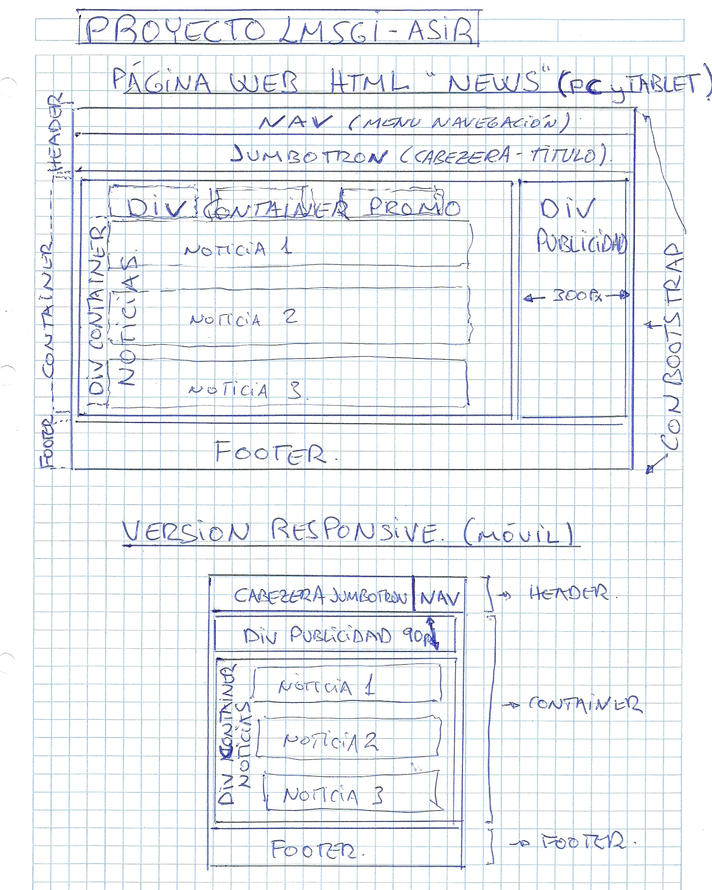

# PROYECTO-FINAL-NEWS-LMSGI07

## Maquetación del proyecto: 
  Layer design del proyecto encargado por el cliente, consistente en la realización de una pagina web de noticias con espacio para la     publicidad ( en el lado derecho) en version PC y tablet de 300 px de ancho , y para versión móvil de 90px de alto en la parte           superior. Todo ello en RESPONSIVE.
  
  
  
  
## Diseño para PC y Tablet (+ de 768px)
### Header. Ocupa el ancho de pantalla y de altura adecuada, incluyendo en el: Contenedor para los elementos del header:
  * NAV (Barra de navegación) Fijada arriba aunque se realice scrolling,  que en su interior dispone de:
      * Boton de inicio para recargar la pagina inicial.
      * Boton desplegable "Otros sitios" que nos deja acceder a las webs de donde se han obtenido las noticias.
      * Boton de indentificación que accede a a solicitar "Usuario y Contraseña".
      * Boton de registro (sin función).
      
  * CABEZERA - TITULO.
      * Se utiliza el elemento de Bootstrap "JUMBOTROM" para generar este apartado

### CONTAINER GENERAL. Ocupa el ancho de pantalla y de altura adecuada
   * Container para colocar Boton activar/desactivar Scroll
   * Container PROMO. 
      * Uso de Bootstrap para generar 3 columnas (Grid) con una promoción de la página (Votaciones).
      * Se dejan 300px a la derecha para el container de publicidad.
   * Container NOTICIAS.
      * Con Bootstrap utilizando "article" generando 3 lineas de noticias principales.
      * Se coloca un botón al final del container par recargar más noticias.
      * Se dejan 300px a la derecha para el container de publicidad.
   * Container PUBLICIDAD
      * Se le da una anchura máxima de 300px y se ubica a la derecha.
      
### FOOTER.  Ocupa el ancho de pantalla y de altura adecuada 
   * Uso de Boopstrap. Conteniendo varios links e informacion del creador.
   
   
## Diseño para dispositivos móviles (- de 768px)
### Header. Ocupa el ancho de pantalla y de altura adecuada, incluyendo en el: Contenedor para los elementos del header:
  * NAV (Barra de navegación) Fijada arriba aunque se realice scrolling, pero quedando oculta sus opciones, accesibles mediante un           desplegable.
  * CABEZERA - TITULO.
      * Se utiliza el elemento de Bootstrap "JUMBOTROM" para generar este apartado

### CONTAINER GENERAL. Ocupa el ancho de pantalla y de altura adecuada
   * Container para colocar Boton activar/desactivar Scroll
   * Container PROMO desparece en versión RESPONSIVE. 
   * Container NOTICIAS.
      * Con Bootstrap se colocan las noticias de forma ordenada y con visión correcta una vez hecho responsive.
      * Se ha adptado el tamaño deñ texto y los margenes ha este aspecto.
   * Container PUBLICIDAD
      * Se le da una altura máxima de 90px y desapareciendo al hacer scrolling hacia abajo.
      
### FOOTER.  Ocupa el ancho de pantalla y de altura adecuada 
   * Uso de Boopstrap adecuado a responsive. Conteniendo varios links e informacion del creador.
 

## Tareas Realizadas

  * Presentación de 3 noticias (en Html).
  * Almacenamiento de 6 noticias más (están en data/1.json y en data/2.json, conteniendo 3 noticias cada una). A las cuales se accederia     clicando en el botón al final de página "Ver más noticias".
  * Se codifica news.js en JQuery con un elemento button para activar o desactivar el scrolling.
  * Se el codifica igualmente el botón al final de página "Ver más noticias" para cargar más noticias de data/1.json y data/2.json.
    (sin funcionamiento).
   * Se codifica la pagina news1.html para que cuando hagamos clic en la primera noticia de la página pricipal (ver noticia completa) se      nos abre dicha página mostrando la imagen en tamaño grande, todo el contenido de la noticiay y un video de "youtube" sobre la            noticia. Todo ello en con la funcion RESPONSIVE. Exactamente lo mismo se ha realizado para news2.html accediendo desde la noticia 2      en la pagina principal.
   * Se ha incluido rss.xml.
   * Cada página contiene las etiquetas meta para compartir el título, descripción, imagen, nombre de la aplicación y url de la página.

## Adecuación del proyecto a las especificaciones del cliente y acabado final.

  * Se ha utilizado un diseño de estilo ligeramente minimalista con uso de paleta de colores adecuada.
  * Se ha realizado separación de los contenedores de noticias y de publicidad.
  * Se han dejado los 300px requeridos en versión PC y tablet, y los 90 px en versión móvil.
  * Desaparece la publicidad fijada arriba en la versón móvil al realizar srcolling hacia abajo.
  * Se han usado las especificaciones requeridas en cuanto a tamaño del título, descripción del artículo de noticias, colocación de la       imagen en el lugar adecuado y presentacion de la fecha y hora de publicación.
  * Todas las noticias tienen el mismo formato, mostrando los datos especificados de forma elegante en todo el dispositivo y en todas su     versiones.
  
## Se ha creado una "Branch" con la versión Minify del proyecto. Ver aqui:

  * http://
  

## Validacion y Minify:

 * http://www.webtoolkitonline.com/json-minifier.html
 * http://jsbeautifier.org/
